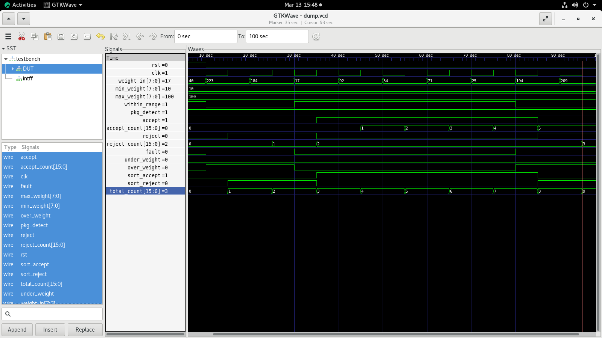
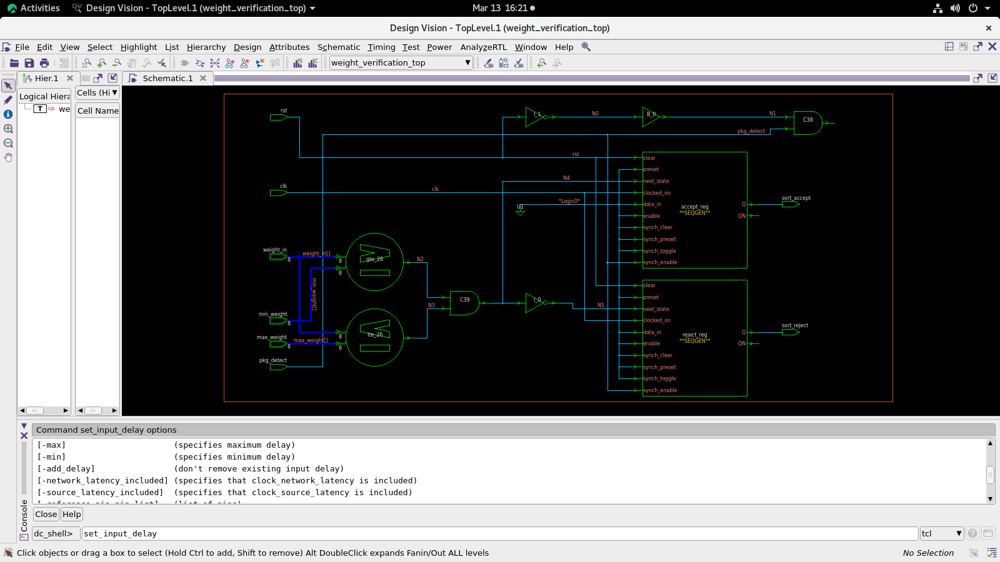
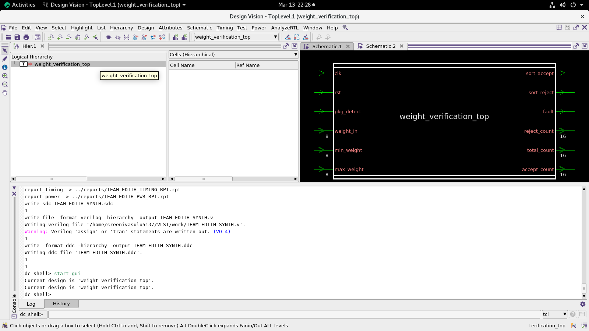
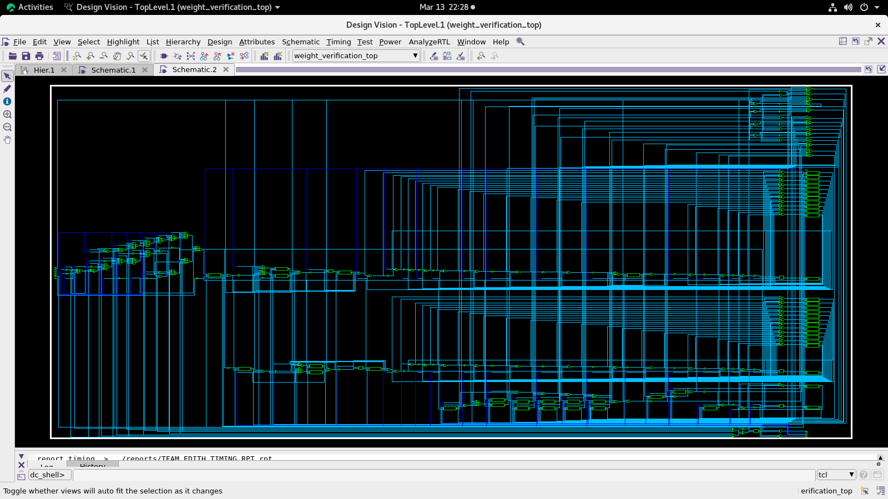

# 24-Hours-Digital-Package-Weight-Verification-System
24-Hour Digital Package Weight Verification System with RTL developed in SystemVerilog, functional verification using SystemVerilog testbenches, simulation in Synopsys VCS, waveform analysis in GTKWave, and synthesis using Synopsys Design Compiler (DC) targeting SAED 28nm/32nm technology.
# RTL to Synthesis Flow
The project follows a standard ASIC RTL-to-Synthesis design flow using Synopsys EDA tools.

# Output Results
Simulation Waveform

# Synthesis Result

# Synthesized Netlist (Design Compiler - SAED 28nm/32nm)

# Tools Used
1. Synopsys VCS – RTL simulation
2.  Synopsys Design Compiler (DC) – RTL synthesis
3. GTKWave – Waveform viewer
4. SystemVerilog – RTL and verification
5. SAED 28nm/32nm – Standard cell technology

# Technology
Target Technology: SAED 28nm / 32nm Standard Cell Library

